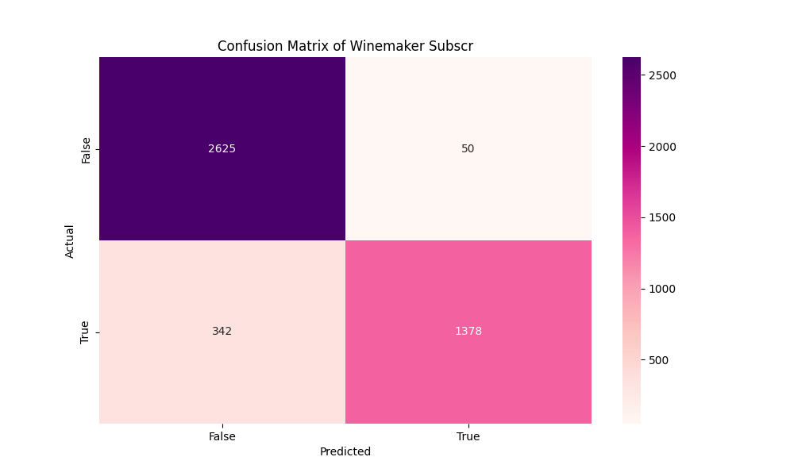
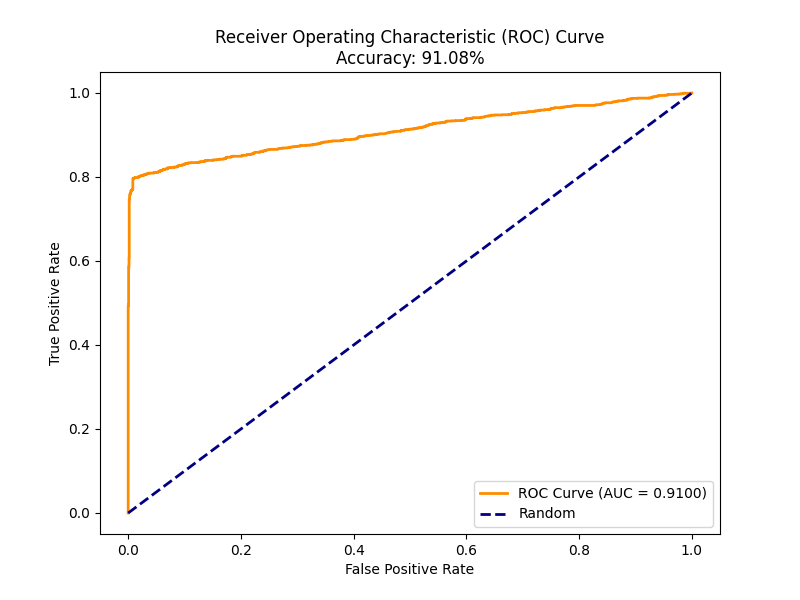

# Winery and You!

This is a collaborative personal portfolio project between [Ayush Shrestha](https://www.linkedin.com/in/ayush-yoshi-shrestha/) and [Hyewon Jeong](https://www.linkedin.com/in/jeonghyewon/). The dataset used is on sales order data for a national winery, accessible [here](data/). The dataset was provided to us by [Dr. Oliver J. Rutz](https://foster.uw.edu/faculty-research/directory/oliver-rutz/) of the University of Washington, Seattle.

## Instructions

For easy version control purposes, the source code is stored as converted Python scripts, but HTML files of the source Python notebooks can be found [here](src/html/). Alternatively, the CLI commands [here](cli-commands-reference.md) can convert the python scripts back into notebooks.

## Business Problem

In the face of a highly competitive, niche industry, wineries must leverage data-driven strategies to maintain their market position. Failure to do so can lead to reduced customer satisfaction and increased churn as competing wineries gain an edge. Therefore, it is essential for wineries to thoroughly analyze their existing data to gain deeper insights into customer behavior and optimize engagement and loyalty.

This project is designed to support such a winery by analyzing sales data from customers across the United States. Through predictive modeling, we aim to provide the winery with actionable insights into the factors that drive high engagement with their three subscription-based marketing channels: email, newsletter, and direct calls. Additionally, we deliver the predictive models themselves that enable the winery to swiftly adapt to customer preferences, thereby enhancing customer loyalty and driving sustained business growth.

## Dataset Overview

The original dataset contains over 65,000 records detailing individual orders by the winery's customers. Key attributes include:

- _Customer and Order IDs_: Unique identifiers for customers and their respective orders.
- _Order Date_: The date when each order was placed.
- _Regional Attributes_: Geographic information including Zip Code and State.
- _Current Subscription Status_: Subscription status to the winery's three marketing channels - Email, Newsletter, and Direct Calls.
- _Sale Amount per Order_: The monetary value of each order, along with the marketing channel through which the sale originated.
- _Pre-defined Customer Segment_: A classification of customers into one of four segments — Casual Visitor, Wine Enthusiast, High Roller, and Luxury Estate.

## Data Cleaning & Transformation

The initial data cleaning of the dataset was carried out using Pandas, focusing on improving data quality and preparing the dataset for analysis. Key steps included:

- _Handling Missing Values_:
  - We investigated the possibility of imputing missing values, such as those in the State column, from other records associated with the same customer.
  - Since imputation was not feasible, missing values were dropped, resulting in a reduction of approximately 1% of the overall dataset.
- _Removing Erroneous Data_:
  - Data anomalies, such as negative Sale Amounts and invalid US State codes, were identified and removed. This process affected about 1.5% of the dataset.

In addition to cleaning, some preliminary feature engineering was performed, which included:

- _Data Type Customization_:
  - Adjusting data types for greater accuracy and utility, such as converting IDs from integers to objects and changing Email Subscription from float to boolean.
- _Geographic Mapping_:
  - Enhancing the granularity of geographic data by mapping US States to their respective US Regions and Divisions.

A supplemental dataframe was also created, aggregating data to capture distinct customer information. This includes details such as each customer's State, Total Order Volume, and Total Sale Amount. This additional dataframe provides a comprehensive view of customer behavior, which is critical for subsequent analysis and modeling efforts.

## Exploratory Data Analysis

Some preliminary EDA was performed in Seaborn and Matplotlib to look at the general shape and distribution of the data. This was expanded upon in a [packaged Tableau workbook](src/winery-dashboard.twbx), yielding novel understanding of customer and order sales figures across the United States as well as over the lifetime of the dataset. A screenshot is shown below:

The dashboard showcases:

- _Geographic Map_: An interactive map showing where customers reside in the United States, with filtering capabilities that dynamically update the other charts in the dashboard based on the selected state.
- _Line Charts_: Display trends in total sales and order volume over the life of the dataset.
- _Stacked Bar Charts_: Illustrate the distribution of customer segments within each geographic division.

The dashboard additionally allows for dynamic filtering by customer segment, region, division, and month-year.

## Modeling & Results

Since this analysis was focussed on customer preferences, the supplemental Customer dataframe was used as the primary dataset for training and validation. To ensure robust model evaluation and identify the best-performing model, an initial train-test split was configured. This allowed for effective training and subsequent assessment of the models. A Scikit-learn pipeline was then created to preprocess the dataset, including scaling numeric features and one-hot encoding categorical features.

Predictive analysis was conducted using Statsmodels and Scikit-learn to develop binary classification models aimed at predicting customers' subscription preferences for email, newsletter, and direct calls. Logistic regression and random forest were selected as the primary models for this analysis due to their ability to provide insights into the importance of each independent variable through coefficients in logistic regression and feature importances in random forest. These insights are crucial for identifying the key factors that the winery can leverage to enhance customer engagement.

### Logistic Regression (Logit)

Three logit models were trained for the three subscription channels, producing the following results:

#### Email Logit

The Email logit model generated the following metrics against the validation set:

- Accuracy: 93.83
- Precision: 87.22
- Recall: 95.32
- F1-Score: 91.09
- AUC: 0.9742

Additionally, the following features (with coefficients) were statistically significant at the 5% level:

- Order Volume: -0.43
- High Roller: 2.55
- Wine Enthusiast: 3.02
- Newsletter Subscriber: 3.22
- Winemaker Call Subscriber: 5.05

#### Direct (Winemaker) Call Logit

The Direct Call logit model generated the following metrics against the validation set:

- Accuracy: 90.24
- Precision: 96.16
- Recall: 78.99
- F1-Score: 86.73
- AUC: 0.9033

Additionally, the following features (with coefficients) were statistically significant at the 5% level:

- Order Volume: 0.35
- Luxury Estate: -0.27
- Newsletter Subscriber: 0.41
- Email Subscriber: 5.02

#### Newsletter Logit

The Newsletter logit model generated the following metrics against the validation set:

- Accuracy: 66.23
- Precision: 75.57
- Recall: 73.00
- F1-Score: 74.26
- AUC: 0.7393

Additionally, the following features (with coefficients) were statistically significant at the 5% level:

- Sale Amount: -0.07
- High Roller: -0.22
- Winemaker Call Subscriber: 0.40
- Email Subscriber: 3.42

### Random Forest (RF)

Similarly, three RF models were trained for the three subscription channels, with the following results:

#### Email RF

The Email RF model generated the following metrics against the validation set:

- Accuracy: 93.01
- Precision: 87.75
- Recall: 91.67
- F1-Score: 89.67

Additionally, these are the feature importances of the variables:

With the following variables having importances at or above the 75th percentile:

- Sale Amount
- Wine Enthusiast
- Newsletter Subscriber
- Winemaker Call Subscriber

#### Direct (Winemaker) Call RF

The Direct Call RF model generated the following metrics against the validation set:

- Accuracy: 88.33
- Precision: 90.09
- Recall: 79.89
- F1-Score: 84.68

Additionally, these are the feature importances of the variables:

With the following variables having importances at or above the 75th percentile:

- Sale Amount
- Wine Enthusiast
- Newsletter Subscriber
- Email Subscriber

#### Newsletter RF

The Newsletter RF model generated the following metrics against the validation set:

- Accuracy: 67.03
- Precision: 76.05
- Recall: 73.85
- F1-Score: 74.94

Additionally, these are the feature importances of the variables:

With the following variables having importances at or above the 75th percentile:

- Order Volume
- Sale Amount
- Winemaker Call Subscriber
- Email Subscriber

## Findings & Recommendations

Based on the metrics, the predictive models for Email and Direct Call subscriptions demonstrate strong performance, while the models for Newsletter subscriptions are solid but offer more room for improvement.

An analysis of the coefficients and feature importances from the logistic regression and random forest models, respectively, reveals a noteworthy outcome. Specifically, in a focal subscription model, whether a customer is subscribed to one of the other two channels has a significant feature importance and a large positive effect on the likelihood of subscribing to the focal channel. This indicates a cross-channel marketing effect.

With this in mind, we can offer the following recommendations:

**Cross-channel Promotion**:

Given the identified cross-channel marketing effect, the winery should leverage cross-channel promotions through targeted messaging to enhance customer engagement. This can be implemented through a tailored approach to maximize impact. Based on the model results, we recommend the following:

- _Enhancing Marketer Calls_: Encourage the sales team to promote the benefits of Email subscriptions to Direct Call subscribers during their next interaction. The high feature importance and positive effect of Direct Call subscriptions on Email subscriptions suggest this strategy could be highly effective.
- _Email Promotions_: Develop promotional email campaigns highlighting the benefits of Direct Call and Newsletter subscriptions to current Email subscribers. Since Email subscriptions have a positive effect and high feature importance for both Direct Call and Newsletter subscriptions, this approach can drive cross-channel engagement.

By implementing these tailored cross-channel promotions, the winery can improve customer engagement across multiple marketing channels and enhance its marketing ROI.

**Emphasis on High-importance Features**:

Given that Direct Call subscription, Email subscription, and Sale Amount are consistently high-importance features across multiple models, the winery should prioritize these factors in its marketing efforts.

This could include:

- _Enhanced Call Engagement_: Invest in improving the training of the sales team responsible for marketer calls, ensuring a pleasant and seamless customer experience. Additionally, consider offering personalized and time-limited promotions to those subscribed to Direct Calls.
- _Email Campaign Improvements_: Strengthen email campaigns by incorporating personalized offers and value-added content. Examples of personalized offers could be welcome gifts, birthday discounts, and re-engagement strategies. Meanwhile, value-added content might include winery history, invitations for on-site visits, and wine pairing tips, all designed to create a more personal connection with customers.
- _Upselling Opportunities_: Recognizing that customers who spend more are more engaged, the winery should explore upselling tactics such as bundling products, offering volume discounts, or promoting relevant accessories and merchandise.

By integrating these recommendations into its business strategy, the winery will be better positioned to boost customer engagement across its marketing channels, leading to increased customer satisfaction, loyalty, and overall revenue.
